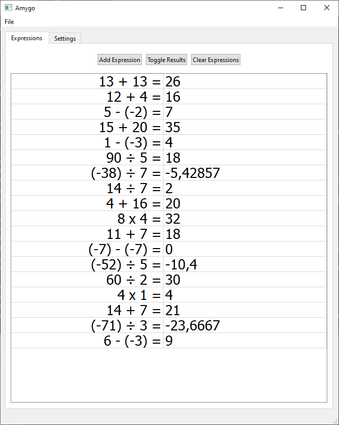
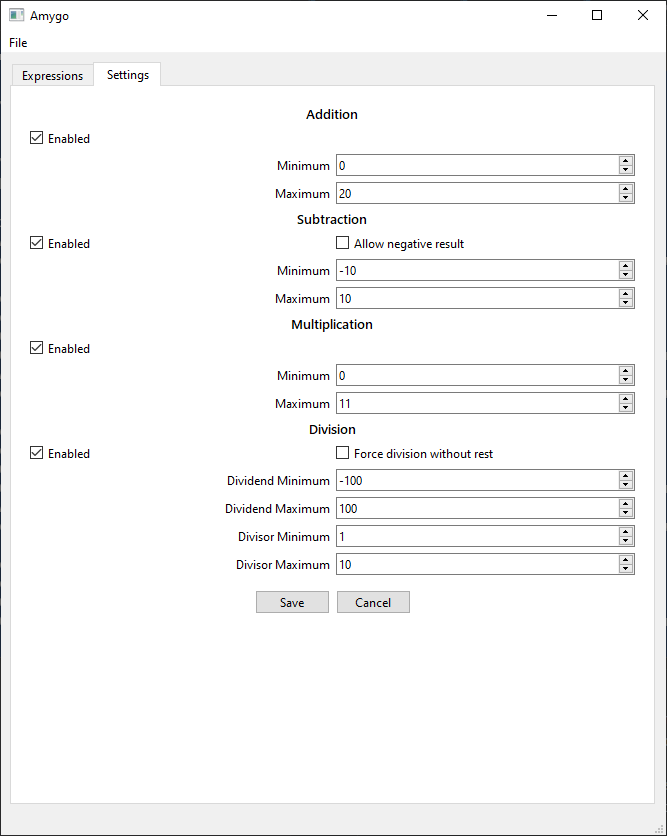

# Amygo
Tool to generate quick math mental exercises for education.

### User Manual
Make sure you are using the latest version from [the release page](https://github.com/Philaeux/Amygo/releases).
Be aware that the settings you set are saved in the ``sqlite.db``. So if you update the software to a new version, bring your database to the new version.

* Add any number of expression with the "Add Expression" button
* Toggle on/off the display of result in the list with "Toggle Results"
* Clear the list of expression with "Clear Expression"

Configure all operation generation with the settings Tab.

### Dev

To update the ui file, use [Qt Designer](https://build-system.fman.io/qt-designer-download).
